# LIRI-node-app

## Purpose and Use

This app is designed for searching for info on movies, songs, or upcoming concerts

The user has two options for completing their search:

  1. entering the command and search when starting the app up
    - valid commands are: 
      * movie-this (use this followed by a movie title)
      `node liri.js movie-this Shawshank Redemption`
      

      if no movie title is specified it will default to the movie Mr. Nobody
      `node liri.js movie-this`
      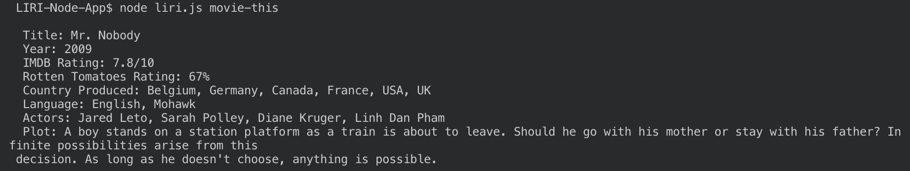

      * concert-this (use this followed by the name of an artist)
      `node liri.js concert-this Miranda Lambert`
      

      * spotify-this-song (use this followed by the title of a song)
      `node liri.js spotify-this-song Trampoline`
      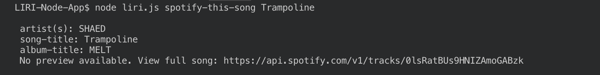

      if no song title is specified it will default to the song The Sign
      `node liri.js spotify-this-song`
      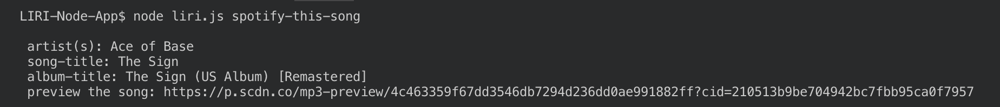

      * do-what-it-says (this does not require any extra input)
      `node liri.js do-what-it-says`

      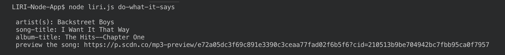
        this accesses the random.txt file and executes the command in that file

  1. starting the app with no command or search paramaters which will launch inquirer for a CLI. This then guides the user through completing the search they would like to make

    `node liri.js`

  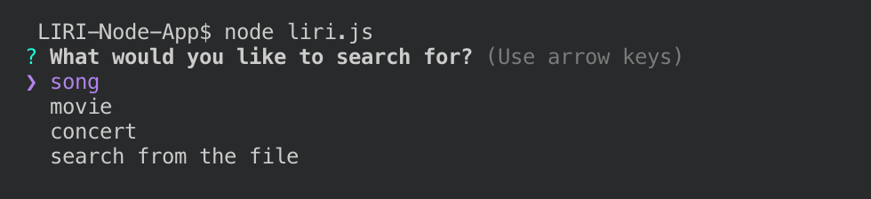

  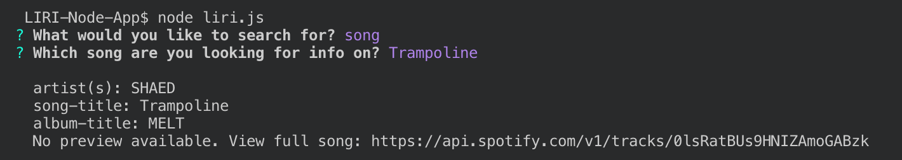

  

  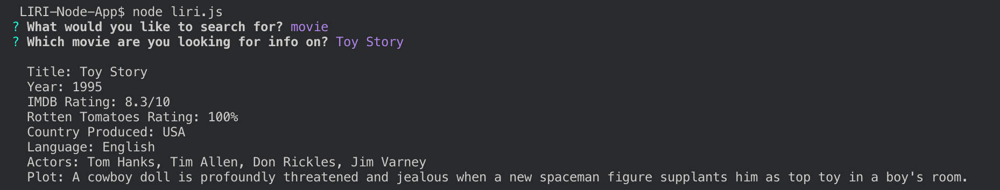

  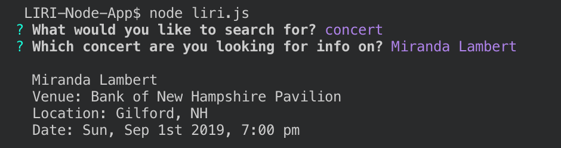

  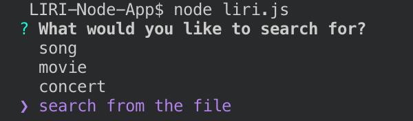

  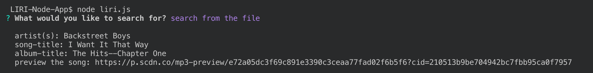

  I also added the ability for users to enter an artist to their song search if they would like to
    
  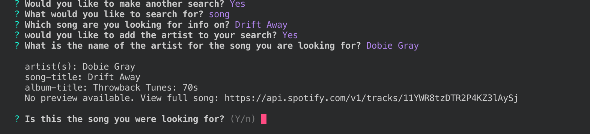
    
  The opportunity to look at other song results if the first one given wasn't the one they were looking for
    
  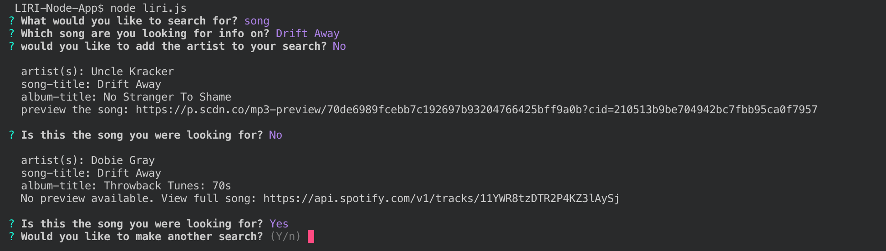
    
  And the ability to continue to make other searches if they would like after one is complete. Until they are done, and then the application will exit

  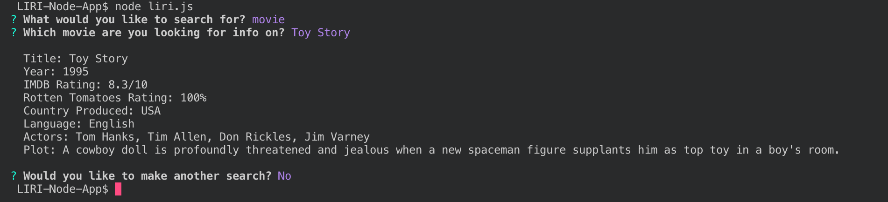

## Development

Node was used to develop this.

The packages used in this development were: 
  * axios
  * inquirer
  * node-spotify-api
  * moment
  * fs

Three main js files are currently being used for this
  - keys.js is used to securely access the keys from the .env file
  - search.js is where all of the main functions for the app are stored - it registers the user input and determines which search functions to use and then exports the two functions
  - liri.js runs the app, accessing the function it needs from the search file depending on user input

This was an assignment I completed myself as part of my coding bootcamp. 

I added inquirer to it to make it more user friendly and added other functionalities beyond the scope of the assignment such as the ability to continue making searches, adding artists to a song search, and being able to look at other song results if the first one presented was not the correct option.